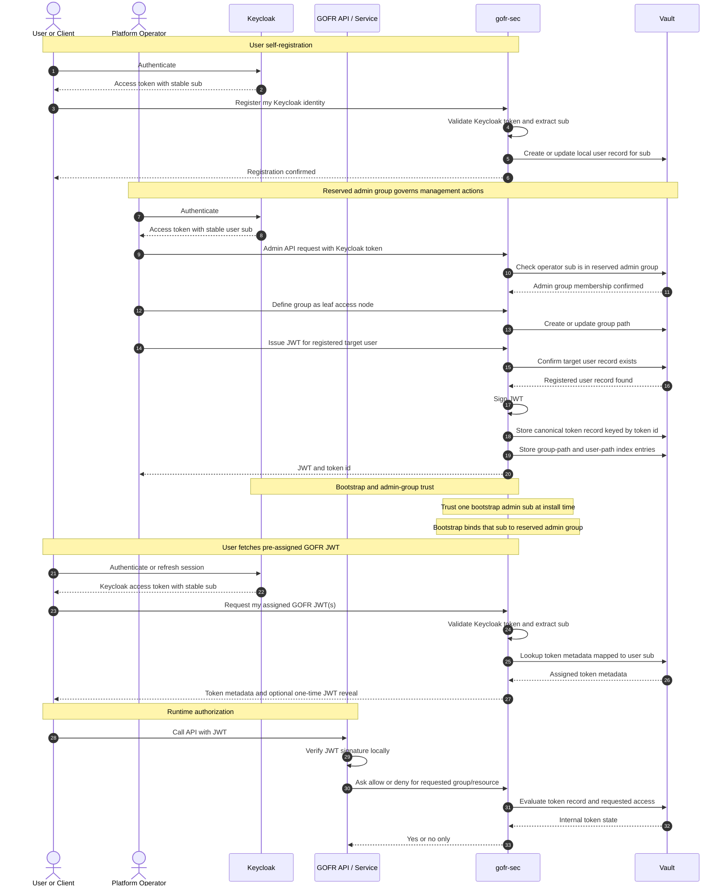

# Proposal: `gofr-sec` Simplified Group and JWT Model

## Summary

GOFR currently splits authentication and secret operations across shared docs,
repo-local scripts, Vault bootstrap artifacts, and per-project secret files.
That model works for early bootstrap, but it keeps privileged material close to
each repo and ties user JWT issuance to a GOFR-managed signing secret.

This proposal introduces a simpler platform service, `gofr-sec`, with a narrow
boundary:

- `gofr-sec` defines groups as leaf access nodes, with one reserved system
  group named `admin` that must always exist.
- Only users associated with the reserved `admin` group can issue signed JWTs
  that grant access to one or more groups.
- A normal user can authenticate with Keycloak and self-register their stable
  Keycloak `sub` with `gofr-sec`.
- GOFR services verify JWT signatures locally, then call `gofr-sec` for a
  yes-or-no decision on the requested group or resource. The response must not
  disclose available groups, resources, ownership, or denial reasons.
- Keycloak defines users and provides a stable user `sub` identifier.
- `gofr-sec` stores GOFR-specific user, group, and token associations keyed by
  the Keycloak `sub`.
- Vault stores canonical token records, group and user lookup indexes,
  signing-key material, and any other GOFR-managed secret material that is not
  already owned by Keycloak, making the first version closer to an API key
  registry than a full OIDC rollout.

The target state is that token issuance and group mapping move out of per-repo
scripts and into `gofr-sec`, while Keycloak is used for user identity and Vault
is used as the only durable store for GOFR-managed secret material outside
Keycloak.

## Core Authority Rule

Only users associated with the reserved `admin` group can:

- create or modify group definitions
- associate users with groups
- mint JWTs
- associate JWTs with Keycloak users
- revoke or rotate JWTs

Normal users can register their own Keycloak identity with `gofr-sec`, but
they can never grant themselves groups or mint their own GOFR JWTs. They may
only use JWTs that have already been issued and assigned by an admin.

## Reserved Group: `admin`

`admin` is a reserved control-plane group inside `gofr-sec`.

- `admin` must always exist.
- `admin` cannot be deleted or renamed.
- Membership in `admin` authorizes all `gofr-sec` management APIs.
- At least one Keycloak user must always remain associated with `admin`.
- `admin` is a system group, not a normal GOFR resource leaf such as
  `plot.read` or `plot.write`.
- `admin` should not be issued inside normal runtime GOFR JWTs. It is a
  control-plane group only.

## Review of the Current State

The current docs and scripts show a consistent pattern:

- `docs/auth/gofr_auth_system.md` describes GOFR-issued JWTs with group claims,
  Vault-backed storage, and a shared JWT signing secret.
- `docs/auth/secrets_sharing_proposal.md` shows that the current bootstrap
  surface still includes `vault_root_token`, `vault_unseal_key`,
  `bootstrap_tokens.json`, and `service_creds/<svc>.json` files.
- `docs/vault/vault_architecture.md` positions Vault as the central secret bank
  and `manage_vault.sh` as the operator entrypoint.
- `scripts/auth_env.sh` reads `secrets/vault_root_token`, mints a short-lived
  Vault operator token, then reads the JWT signing secret from Vault.
- `scripts/auth_manager.sh` and `scripts/bootstrap_auth.sh` use
  `service_creds/gofr-admin-control.json` to log in with AppRole before doing
  auth management.
- `scripts/setup_approle.py` uses Vault bootstrap artifacts to provision roles
  and then writes AppRole credentials back to disk.
- `scripts/bootstrap_vault.py` and the `gofr_common.auth` package still assume
  GOFR owns the JWT signing secret and creates HS256 tokens whose records are
  stored in Vault.

### Problems With the Current Model

1. User identity and project secret management are mixed together.
2. Token issuance, token ownership, and group mapping are split across code,
  scripts, and local secret files.
3. Operator workflows still depend on break-glass material being reachable from
   repo-local `secrets/` paths.
4. Service bootstrap still writes durable credentials to disk
   (`service_creds/*.json`).
5. Multi-project reuse is improved by shared secret locations, but the control
   path is still script-heavy and filesystem-heavy.

## Goals

- Make `gofr-sec` authoritative for group definitions and JWT issuance.
- Treat most groups as leaf permissions that services can authorize against,
  with `admin` as a reserved system exception.
- Let GOFR services verify JWT signatures locally and then ask `gofr-sec` for
  an allow-or-deny decision.
- Use Keycloak for user accounts and stable user identifiers, not as the
  runtime token issuer or GOFR token registry in the first version.
- Use Vault as the only durable store for GOFR-managed secret material outside
  Keycloak, including signing keys, canonical token records, user indexes,
  group indexes, and any optional one-time reveal secrets.
- Replace repo-local credential file workflows with a small service API.
- Preserve a narrow break-glass bootstrap path for platform operators.

## Non-Goals

- Replacing Vault with Keycloak.
- Making Keycloak the runtime JWT issuer in the first version.
- Eliminating all bootstrap artifacts on day one.
- Forcing every GOFR service to talk to Vault directly.
- Rewriting all existing auth and secret tooling in a single cutover.
- Keeping old and new GOFR auth paths alive behind a runtime migration flag in
  the target model.

## Proposed Service Boundary

`gofr-sec` should start as a small auth and token service rather than a broad
platform control plane.

### Keycloak Responsibilities

- Store users and credentials.
- Enforce MFA and login policies.
- Provide stable user identifiers via the user `sub` claim.
- Remain the source of truth for user identity, not GOFR group entitlements.

### `gofr-sec` Responsibilities

- Define and manage GOFR groups as access leaf nodes.
- Ensure the reserved `admin` group always exists.
- Register Keycloak-authenticated users into a local GOFR user registry keyed
  by Keycloak `sub`.
- Manage Keycloak-user-to-GOFR-group associations.
- Require a target user to be registered before admin token assignment.
- Allow only `admin` group members to issue signed JWTs that map to one or
  more groups.
- Expose an authorization API that returns only yes or no for a requested group
  or resource.
- Manage token lifecycle: create, associate, revoke, rotate, inspect.
- Allow only `admin` group members to associate issued tokens with Keycloak
  users.
- Allow only `admin` group members to revoke or rotate issued tokens.
- Centralize audit logging for token and group operations.
- Replace the current shell-driven auth flows with an API and thin CLI wrapper.

### Vault Responsibilities

- Store registered GOFR user records keyed by Keycloak `sub`.
- Store user-to-group entitlement mappings keyed by Keycloak `sub`.
- Store one canonical token record keyed by token id.
- Store user-to-token lookup indexes keyed by Keycloak `sub`.
- Store group-to-token lookup indexes keyed by GOFR group.
- Store and manage `gofr-sec` signing-key material and any optional one-time
  reveal secret material.
- Remain the only place where GOFR-managed secret material is stored outside
  Keycloak.
- Keep break-glass root and unseal procedures as a platform-only concern.

### `gofr-common` Responsibilities After the Cutover

- Verify `gofr-sec` JWTs locally using a cached verification key.
- Call `gofr-sec` for runtime authorization decisions.
- Provide a client SDK for `gofr-sec`.
- Stop acting as the token issuer.
- Cache authorization decisions where appropriate.

## Target Architecture



The critical change is that `gofr-sec` becomes the token issuer and group
authority, while Keycloak is used only for user identity and stable user
identifiers.

## Token Model

### Issued JWTs

The first version should treat GOFR JWTs as signed API keys.

Recommended properties:

- Only a user in the reserved `admin` group can request token creation.
- `gofr-sec` signs the JWT.
- GOFR services verify the signature locally.
- The token contains a stable token id such as `jti`, the owner `sub`, and
  standard metadata such as `iss`, `iat`, `nbf`, and `exp`.
- The token does not need authoritative group claims in v1.
- Access decisions are resolved from `gofr-sec` after signature validation.
- A token may map to one or more groups in the server-side token record.
- The raw JWT should be returned only at mint time or through a controlled
  one-time reveal flow. Routine list and inspect APIs should return metadata.

Recommended signing approach:

- Use asymmetric signing such as RS256 so services only need a public
  verification key.
- Publish the verification key from `gofr-sec` or distribute it as secure
  config.

This keeps runtime verification simple while avoiding a shared signing secret in
every service.

### Runtime Authorization

Services should not treat the token payload alone as the authority for groups
or access decisions. Instead they should:

1. Verify the JWT signature locally.
2. Extract the token id and owner `sub`.
3. Ask `gofr-sec` whether the token is allowed to access the requested
  group or resource.
4. Honor the returned yes-or-no response.

The runtime authorization response must not be an introspection response. It
must not include token owner, token status, token groups, matching policies,
resource existence, or a human-readable denial reason. Denials for unknown
resources, revoked tokens, expired tokens, and missing group membership should
all look the same to the calling service.

Recommended response body:

```json
{"allowed": true}
```

or:

```json
{"allowed": false}
```

Services should fail closed if `gofr-sec` is unreachable and no valid cached
decision exists. Any cache TTL should be short, bounded by the JWT expiry, and
short enough that revocation remains useful.

That makes revocation and remapping possible without giving up local signature
verification.

### User Identity And Registration

Keycloak is not the runtime token issuer in this model. It is the user system.

`gofr-sec` should maintain GOFR-specific registration, entitlements, and token
links keyed by the Keycloak user `sub`.

Keycloak should provide:

- the user account
- the stable user `sub`

`gofr-sec` should store or expose:

- whether that `sub` has completed GOFR user registration
- which GOFR groups are associated with that `sub`
- whether that `sub` is in the reserved `admin` group
- which token ids are associated with that `sub`

This lets GOFR keep API-key-like runtime auth while still having a proper user
directory.

### How a User Gets a GOFR JWT

The user should register their Keycloak identity with `gofr-sec` themselves,
but they should not register or associate a GOFR JWT themselves. That would
break the admin-only control rule.

The cleaner flow is:

1. The user authenticates with Keycloak.
2. The user calls `gofr-sec` to register their Keycloak `sub`.
3. `gofr-sec` validates the Keycloak token, extracts `sub`, and creates a
  local GOFR user record.
4. The registered user asks an admin to grant access.
5. An `admin` group member associates that registered `sub` with one or more
  GOFR groups.
6. That same admin mints a GOFR JWT for that target `sub`.
7. `gofr-sec` stores the token, owner `sub`, and group mappings in Vault.
  The canonical record is stored by token id, with group and user paths acting
  as lookup indexes.
8. The user calls `gofr-sec` with the Keycloak token to fetch JWTs that are
   already associated with their `sub`.
9. `gofr-sec` validates the Keycloak token, extracts `sub`, and returns only
  token metadata already assigned to that user.
10. If token retrieval is enabled, `gofr-sec` may reveal the raw JWT once and
   then keep only the token hash plus metadata.

No new association happens in the user fetch flow. The user is only retrieving
a pre-assigned GOFR token or its metadata.

### Bootstrap Admin Group Membership

`gofr-sec` needs a first trusted Keycloak user bound to the reserved `admin`
group before any normal admin workflow can exist.

Recommended bootstrap model:

1. Configure one or more trusted Keycloak `sub` values in `gofr-sec` install
  configuration.
2. On first boot, bind those bootstrap identities to the reserved `admin`
   group.
3. After bootstrap, all group and token administration goes through normal
  admin-group-guarded APIs.
4. Prevent removal of the last user in the `admin` group.
5. Keep a break-glass recovery command for restoring `admin` group membership
  if all admin assignments are lost.

## Secret Model

Vault becomes the only durable store for GOFR-managed secret material outside
Keycloak in the first version.

Recommended secret path layout:

```text
secret/data/gofr/sec/users/<keycloak-user-id>/profile
secret/data/gofr/sec/tokens/<token-id>
secret/data/gofr/sec/groups/<group>/tokens/<token-id>
secret/data/gofr/sec/users/<keycloak-user-id>/groups
secret/data/gofr/sec/users/<keycloak-user-id>/tokens/<token-id>
```

Recommended storage semantics:

- `secret/data/gofr/sec/tokens/<token-id>` is the canonical token record.
- `secret/data/gofr/sec/groups/<group>/tokens/<token-id>` is a group index or
  reference entry, not necessarily a duplicate full JWT record.
- `secret/data/gofr/sec/users/<keycloak-user-id>/tokens/<token-id>` is a user
  index or reference entry used for `GET /v1/me/tokens` and audit lookups.
- `secret/data/gofr/sec/users/<keycloak-user-id>/groups` stores the user's
  assigned GOFR groups.

Recommended token record fields:

- token id
- owner Keycloak `sub`
- granted groups
- status
- issued at
- expires at
- issued by admin `sub`
- revoked at if present
- JWT hash
- optional pending one-time reveal reference if raw JWT retrieval is enabled

### Token Material Handling

Treat raw GOFR JWTs like API keys.

- Store signing-key material in Vault only. Do not add filesystem, repo-local,
  or per-service secret-file mirrors for GOFR-managed signing or reveal
  material once `gofr-sec` owns issuance.
- Prefer storing a hash of the JWT in the canonical token record.
- Return the raw JWT at admin mint time only, unless user self-service pickup is
  explicitly required.
- If user pickup is required, store raw token material as a pending one-time
  reveal secret in Vault and clear it after first successful retrieval.
- Routine list, inspect, and audit APIs should return metadata, never raw JWTs.
- Revocation and authorization should rely on the token id, hash, status, owner
  `sub`, and group indexes.

This is intentionally closer to an API key store than a dynamic secret broker.

For simplicity, avoid introducing a separate relational database in phase 1.
Vault can hold the token registry until scale or query needs force a split.

## Proposed `gofr-sec` APIs

### Admin APIs

- `POST /v1/groups`
  Admin-group only. Create a group as a leaf access node.
- `POST /v1/users/{keycloakSub}/tokens`
  Admin-group only. Mint and associate a JWT for a registered Keycloak user
  with one or more groups.
- `POST /v1/users/{keycloakSub}/groups/{group}`
  Admin-group only. Associate a Keycloak user with a GOFR group.
- `DELETE /v1/users/{keycloakSub}/groups/{group}`
  Admin-group only. Remove a Keycloak user from a GOFR group, except removal
  of the last `admin` membership.
- `POST /v1/tokens/{tokenId}/revoke`
  Admin-group only. Revoke a token.
- `GET /v1/tokens/{tokenId}`
  Admin-group only. Inspect token metadata.

### User APIs

- `POST /v1/me/register`
  Requires a Keycloak access token. Create or refresh the local GOFR user
  record for the caller `sub`.
- `GET /v1/me`
  Requires a Keycloak access token. Return the caller profile, registration
  status, and assigned GOFR groups.

- `GET /v1/me/tokens`
  Requires a Keycloak access token. Return GOFR token metadata already
  associated with the caller `sub`.
- `POST /v1/me/tokens/{tokenId}/reveal`
  Optional. Requires a Keycloak access token. Return the raw GOFR JWT only if a
  pending one-time reveal exists for the caller `sub`.

### Runtime APIs

- `POST /v1/runtime/authorize`
  Return only yes or no for a token and requested group or resource. Do not
  return groups, ownership, token status, matching policy, resource existence,
  or denial reason.
- `GET /v1/runtime/keys/public`
  Return the verification key used for local JWT signature checks.
- `GET /v1/runtime/groups/{group}`
  Optional endpoint for group metadata.

### Audit Requirements

Every admin and runtime token or group action should log:

- caller identity
- token id when present
- requested group or resource when relevant
- requested operation
- decision result
- correlation id
- associated Keycloak user when present

Audit detail is internal to `gofr-sec`; it must not be returned by the runtime
authorization API.

## What Happens to the Current Scripts

### Scripts to Keep as Break-Glass or Platform Bootstrap

- `manage_vault.sh`
- the narrow Vault bootstrap path

These should remain platform tools, not project-facing day-to-day tooling.

### Scripts to Replace or Downgrade to Transitional Wrappers

- `auth_env.sh`
- `auth_manager.sh`
- `bootstrap_auth.sh`
- `setup_approle.py`
- `bootstrap_vault.py`

Target behavior after migration:

- group and token management comes from `gofr-sec`
- Keycloak is used for user identity, not runtime token validation or GOFR
  token storage
- only users in the reserved `admin` group can mint, associate, rotate, or
  revoke JWTs
- Vault is the only place where GOFR-managed secret material is stored outside
  Keycloak
- per-service disk artifacts such as `service_creds/*.json` are no longer the
  standard runtime auth contract

## Required Changes in `gofr-common`

`gofr-common` should shift from token issuer to verification and resolution
client.

Required changes:

1. Add local verification of `gofr-sec` JWTs using a cached verification key.
2. Add a `gofr-sec` client for runtime authorization checks.
3. Add a small cache for token id to authorization decisions where safe.
4. Deprecate direct token issuance from application code.
5. Keep existing Vault helpers only where `gofr-sec` still needs them.

## Recommended Migration Plan

### Phase 0: Stop Expanding the Old Trust Model

- Do not add new scripts that read `vault_root_token` for normal operator work.
- Do not add new application dependencies on repo-local token files.
- Treat `service_creds/*.json` as transitional.

### Phase 1: Stand Up Group Registry in `gofr-sec`

- Implement group definitions as leaf access nodes.
- Create the reserved `admin` group and make it immutable.
- Define the Vault path layout for group-token storage.
- Add bootstrap admin configuration based on trusted Keycloak `sub` values.
- Add basic admin APIs for groups.

### Phase 2: Add JWT Issuance

- Implement admin-only token signing in `gofr-sec`.
- Load and manage signing-key material from Vault only.
- Store issued JWT records in Vault.
- Add token inspect, association, and revoke APIs.

### Phase 3: Add Runtime Authorization

- Add `gofr-sec` allow or deny endpoint.
- Update `gofr-common` so services verify locally and then ask `gofr-sec` for
  an authorization decision.
- Cache authorization responses conservatively.

### Phase 4: Add Keycloak User Association

- Use Keycloak for user accounts and stable `sub` identifiers.
- Add user self-registration API backed by a local GOFR user record.
- Add admin-group-guarded user-to-group and token-to-user association APIs in
  `gofr-sec`.
- Keep runtime service auth based on `gofr-sec` JWTs.

### Phase 5: Retire Legacy Token Tooling

- Remove or freeze direct `create_token` usage from applications.
- Remove `bootstrap_tokens.json` from the normal operating model.
- Remove repo-local token issuance and storage assumptions from scripts.
- Cut services over one at a time, but treat each service migration as a hard
  cutover with no runtime migration flag that keeps both old and new GOFR auth
  paths active.

## Risks and Open Questions

1. Decide how long services may cache allow or deny responses.
2. Decide whether user self-service one-time JWT reveal is required in phase 1.
3. Decide whether `gofr-sec` should mirror token references back into Keycloak
  user attributes or keep GOFR token mappings entirely in its own store.
4. Plan signing-key rotation, bootstrap admin recovery, and verification-key
  distribution for GOFR services.
5. Decide whether registration is implicit on first authenticated call or
  requires an explicit `POST /v1/me/register` step.

## Recommendation

Build `gofr-sec` first as a narrow group and token service with three explicit
integrations:

- Keycloak for user identity and stable `sub` identifiers
- Vault for canonical token records plus user and group lookup indexes
- `gofr-common` for local verification and runtime authorization

The most important design decision is this:

`gofr-sec` should own group definitions and JWT issuance, with `admin` modeled
as a reserved group that must always exist.

That gives GOFR a simpler first model:

- services can verify tokens locally
- services can still ask a central authority for an allow or deny decision
- Keycloak remains the user system instead of becoming the runtime auth system
- Vault remains the durable registry for issued tokens

Service migration should also stay simple: cut over one service at a time, but
do not keep both legacy and `gofr-sec` auth paths alive behind a runtime
migration flag inside the same service.

This is easier to reason about than a full Keycloak-first runtime design and it
fits the API-key-style access pattern you described while still creating a clean
path to harden the system later.